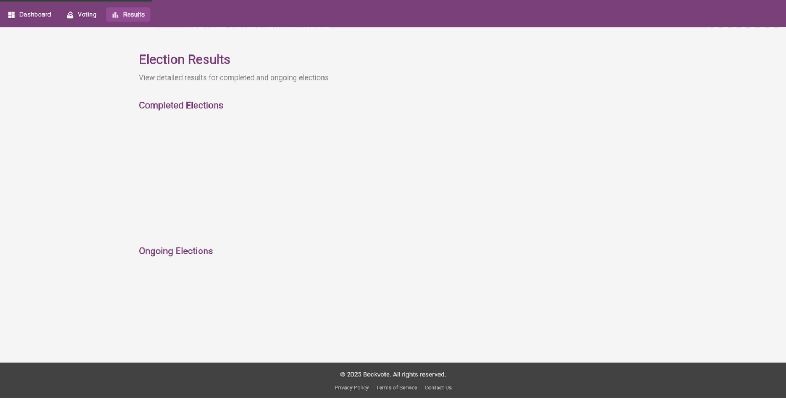

# BockVote - Blockchain-Enabled Voting Application

A secure, transparent, and decentralized voting platform combining Flutter frontend with a custom Go-based blockchain backend.



## 🚀 Features

- ✅ **Secure Authentication** - JWT-based auth with refresh tokens
- ✅ **Blockchain Verification** - Every vote recorded on blockchain
- ✅ **Real-time Updates** - WebSocket for live results
- ✅ **Admin Panel** - Complete election and user management
- ✅ **Multi-platform** - Web, iOS, Android, Desktop
- ✅ **Role-based Access** - Admin and Voter roles
- ✅ **Vote Verification** - Verify your vote on blockchain
- ✅ **Transparent Results** - Real-time election results

## 📋 Quick Start

### Prerequisites
- Go 1.18+
- Flutter 3.0+
- Git

### Installation

```bash
# Clone repository
git clone https://github.com/yourusername/bockvote.git
cd bockvote

# Start backend
cd projectx
go build -o bockvote-server main.go
./bockvote-server

# Start frontend (new terminal)
cd ..
flutter pub get
flutter run -d chrome
```

**Default Login Credentials:**
- Admin: `admin@bockvote.com` / `admin123`
- Voter: `voter@bockvote.com` / `voter123`

📖 **Full guide:** [Quick Start Guide](docs/QUICK_START.md)

## 🏗️ Architecture

```
┌─────────────────────────────────────────────────────────┐
│                    Flutter Frontend                      │
│  (Web, iOS, Android, Desktop)                           │
└────────────────────┬────────────────────────────────────┘
                     │
                     │ REST API / WebSocket
                     │
┌────────────────────▼────────────────────────────────────┐
│              Go Backend API Server                       │
│  • JWT Authentication                                    │
│  • Election Management                                   │
│  • Vote Processing                                       │
│  • Real-time WebSocket                                   │
└────────────────────┬────────────────────────────────────┘
                     │
                     │
┌────────────────────▼────────────────────────────────────┐
│           Custom Blockchain (Go)                         │
│  • Proof-of-Authority Consensus                         │
│  • Vote Verification                                     │
│  • Immutable Ledger                                      │
└─────────────────────────────────────────────────────────┘
```

## 📁 Project Structure

```
bockvote/
├── projectx/                 # Go Backend
│   ├── api/                 # REST API & WebSocket
│   │   ├── server.go        # Main server
│   │   ├── auth_handler.go  # Authentication
│   │   ├── voting_handler.go # Voting endpoints
│   │   ├── admin_handler.go # Admin endpoints
│   │   └── middleware.go    # JWT & CORS
│   ├── core/                # Blockchain core
│   ├── crypto/              # Cryptography
│   └── main.go              # Entry point
├── lib/                     # Flutter Frontend
│   ├── core/                # Core utilities
│   ├── data/                # Data layer
│   ├── features/            # Feature modules
│   │   ├── auth/           # Authentication
│   │   ├── voting/         # Voting
│   │   ├── admin/          # Admin panel
│   │   └── results/        # Results
│   └── main.dart           # Entry point
├── docs/                    # Documentation
│   ├── API_DOCUMENTATION.md
│   ├── DEPLOYMENT_GUIDE.md
│   ├── TESTING_GUIDE.md
│   └── QUICK_START.md
└── test/                    # Tests
```

## 🔌 API Endpoints

### Authentication
- `POST /auth/register` - Register user
- `POST /auth/login` - Login
- `POST /auth/refresh` - Refresh token

### Elections
- `GET /elections` - List elections
- `GET /elections/:id` - Get election
- `GET /elections/:id/results` - Get results

### Voting
- `POST /vote` - Cast vote
- `GET /votes/history` - Voting history
- `GET /votes/:id/verify` - Verify vote

### Admin
- `POST /admin/elections` - Create election
- `GET /admin/users` - Manage users
- `GET /admin/dashboard/stats` - Statistics

### Blockchain
- `GET /block/:id` - Get block
- `GET /tx/:hash` - Get transaction
- `GET /network_state` - Network status
- `GET /ws` - WebSocket connection

📖 **Full API docs:** [API Documentation](docs/API_DOCUMENTATION.md)

## 🧪 Testing

```bash
# Backend tests
cd projectx
go test ./...

# Frontend tests
flutter test

# Integration tests
flutter test integration_test/

# API tests
./test/api_test.sh
```

📖 **Testing guide:** [Testing Guide](docs/TESTING_GUIDE.md)

## 🚢 Deployment

### Docker Deployment

```bash
docker-compose up -d
```

### Manual Deployment

```bash
# Build backend
cd projectx
go build -o bockvote-server main.go

# Build frontend
flutter build web --release

# Deploy with Nginx
sudo cp -r build/web/* /var/www/bockvote/
```

📖 **Deployment guide:** [Deployment Guide](docs/DEPLOYMENT_GUIDE.md)

## 📊 Features Overview

### For Voters
- ✅ View active elections
- ✅ Cast secure votes
- ✅ Verify votes on blockchain
- ✅ View real-time results
- ✅ Access voting history

### For Admins
- ✅ Create and manage elections
- ✅ Add/remove candidates
- ✅ Manage users and roles
- ✅ View system statistics
- ✅ Export election data
- ✅ Monitor system health

## 🔒 Security Features

- **JWT Authentication** - Secure token-based auth
- **Password Hashing** - Bcrypt encryption
- **Blockchain Verification** - Immutable vote records
- **CORS Protection** - Configured for security
- **Rate Limiting** - Prevent abuse
- **Role-based Access** - Admin/Voter separation
- **Audit Logging** - Track all actions

## 🛠️ Technology Stack

### Frontend
- **Flutter** - Cross-platform UI framework
- **Provider** - State management
- **GoRouter** - Navigation
- **Dio** - HTTP client
- **WebSocket** - Real-time updates

### Backend
- **Go** - High-performance backend
- **Echo** - Web framework
- **JWT** - Authentication
- **WebSocket** - Real-time communication
- **Bcrypt** - Password hashing

### Blockchain
- **Custom Go Blockchain** - Built from scratch
- **Proof-of-Authority** - Consensus mechanism
- **Cryptographic Signing** - Vote verification

## 📸 Screenshots

### Login Screen


### Elections Dashboard


### Voting Interface


### Results


### Admin Panel


## 📚 Documentation

- [Quick Start Guide](docs/QUICK_START.md)
- [API Documentation](docs/API_DOCUMENTATION.md)
- [Deployment Guide](docs/DEPLOYMENT_GUIDE.md)
- [Testing Guide](docs/TESTING_GUIDE.md)
- [Implementation Plan](IMPLEMENTATION_PLAN.md)
- [Blockchain Key Management](docs/BLOCKCHAIN_KEY_MANAGEMENT.md)

## 🤝 Contributing

1. Fork the repository
2. Create feature branch (`git checkout -b feature/amazing-feature`)
3. Commit changes (`git commit -m 'Add amazing feature'`)
4. Push to branch (`git push origin feature/amazing-feature`)
5. Open Pull Request

## 📝 License

This project is licensed under the MIT License - see the LICENSE file for details.

## 🙏 Acknowledgments

- Built on top of [Project X](https://github.com/anthdm/projectx) blockchain
- Flutter framework by Google
- Go programming language

## 📞 Support

- **Issues:** [GitHub Issues](https://github.com/yourusername/bockvote/issues)
- **Documentation:** Check `docs/` folder
- **Email:** support@bockvote.com

## 🗺️ Roadmap

- [x] Core blockchain implementation
- [x] REST API with authentication
- [x] Flutter frontend
- [x] Real-time WebSocket updates
- [x] Admin panel
- [x] Vote verification
- [ ] Mobile biometric authentication
- [ ] Multi-language support
- [ ] Advanced analytics dashboard
- [ ] Email notifications
- [ ] Two-factor authentication

## ⚠️ Important Notes

- **Development Mode:** Default credentials are for testing only
- **Production:** Change all secrets and credentials
- **Security:** Enable HTTPS in production
- **Database:** Use PostgreSQL for production
- **Backup:** Implement regular backups

---

**Made with ❤️ for transparent and secure voting**

**Star ⭐ this repo if you find it useful!**
